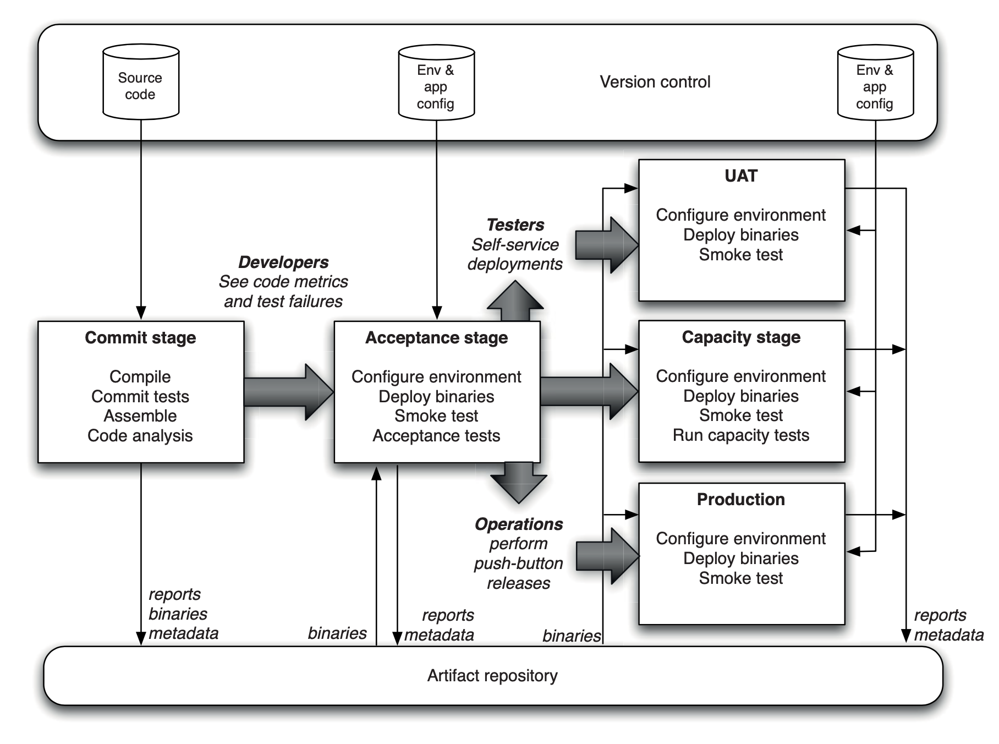

## Anatomy of the Deployment Pipeline

### Challenges

- Waste in testing and operations due to delays.
- Build and operations teams waiting for documentation or fixes.
- Testers waiting for "good" builds.
- Late bug reports affect development progress.
- Architectural issues discovered late.

### Holistic Approach to Software Delivery:

- Adopt an end-to-end delivery process, on a simplest trigger (as simple as on a click of button)
- Automate build, deploy, test, and release. 
- Deploy applications easily, even to production.
- Regular deployments introduces a feedback loop between code and deployment process.
- Pull system. Testing and Ops team "pulls" good Release candidate to their environments. (on push of button)
- Managers can watch key metrics as cycle time, throughput, and code quality

### A Basic Deployment Pipeline

Process:
1. developers commits changes into VCS
2. CI system triggers pipeline:
    1. First stage: compile code, run unit tests, code analysis
    2. Second stage: longer-running automated acceptance tests (execute in parallel, dividing by test-suites)
3. Release is created, ready to deploy on multiple env (UAT, prod etc.)
4. Respective environment owners pulls the release into their environments.
5. Automated deployment script runs for the environment
6. Finally, CI shows deployments for environment as a feedback loop

### Deployment Pipeline Practices

1. Only Build Your Binaries Once
    1. Common practice involves compiling code multiple times, leading to potential differences b/w different environments
    2. Risk factors include different compiler versions, third-party library variations, and configuration changes
    3. Binaries deployed in production should match those tested
    4. Build binaries only once during the commit stage. Only configuration should differ between environments

2. Deploy the Same Way to Every Environment
    1. Each environment possesses unique attributes (e.g., IP address, configuration settings, database location).
    2. Use consistent deployment script but manage environment-specific settings separately (in properties file)
    3. Store properties files in version control, select the appropriate one based on hostname or environment variables.
    4. Configuration options can also be stored in directory services (e.g., LDAP, ActiveDirectory) or accessed via a database through an application like ESCAPE.
    5. Use the same deployment script for all environments, including production.

3. Smoke-Test Your Deployments
    1. Automated script verifies application functionality
    2. Do as simple as launching application and see if desired content is on the page (or expected response from api)
    3. check services, the application depends on, such as DB, cache, third party api, messaging bus, confirming if they are operational

4. Each Change Should Propagate through the Pipeline Instantly
    1. Frequent check-ins on large teams may outpace pipeline stages.
    2. CI system checks for new changes after a stage completes.
    3. Builds off the most recent set of changes to avoid falling behind.
        
        Eg: dev commits Ver1, CI system triggers unit tests stage, then acceptance tests.
        Meanwhile, dev commits Ver2, Ver3 and Ver4. When acceptance tests (trigerred by Ver1) finishes,
        it should not start again for Ver2 or 3. It should start with most recent build, i.e Ver4.
        If unit test fail (or any stage fails), dev can restart any stage with particular Version (eg Ver3)
        to see which version caused the failure. Finally, they release fix in new version (Ver5) which passes.
    4. Smart scheduling ensures timely integration of changes. Make sure your CI supports smart scheduling

5. If Any Part of the Pipeline Fails, Stop the Line

### Commit stage

1. First stage in pipeline, after developer checkin the code
2. Objectives include:
    1. eliminate builds that are unfit for production
    2. Assert that fundamental functionality is tested, including the build and assets.
    3. signal the team that the application is broken as quickly as possible
3. should ideally take less than five minutes to run, and certainly no more than ten minutes
4. Steps:
    1. Run a set of commit tests. Developers should wait and fix the tests before moving on to next task.
    2. Create binaries and assets for use by later stages.
    3. Perform code analysis to check its health.
    4. Prepare artifacts, such as test databases, for use by later stages.
5. Collect useful non-functional metrics, such as:
    1. Test coverage (ideally 80%, must cover happy paths, and data changes handling)
    2. Amount of duplicated code
    3. Cyclomatic complexity
    4. Afferent and efferent coupling
    5. Number of warnings
    6. Code style
6. Create build and release candidate. Ready for QA, Ops to pull-in anytime

### Automated Acceptance Test stage

1. second significant milestone in the lifecycle of a release candidate
2. without running acceptance tests in a production-like environment, we know nothing about the production outcome of app.
3. Goal is to assert that the system delivers the value the customer is expecting and that it meets the acceptance criteria
4. the development team must respond immediately to acceptance test breakages.
5. Best practices:
    1. Run on production replica
    2. Test doubles for any external services (sandbox, or bypass them with mock return values)
    3. Run device target environments (e.g. for android apps) in CI grid parallely
    4. developers must be able to run automated acceptance tests on their development environments
    5. should be expressed in the language of the business (and not in the language of the technology of the application)
    6. Use BDD testing tools, which allows to mentioned "Given-When-Then" scenarios
6. Passing acceptance test stage makes the release from "domain of developers" to "wider audience domain"

### Subsequent test stages (Deploy)

For complex systems, simply acceptance tests are not enough to provide that application will work in prod.
More stages are required to make those assertions true. Here are some:

- #### Deployment stage
  1. Manually trigerred pipeline. It should show the latest release status of previous build, with a button to deploy
  2. Empowers testers to deploy builds on demand. They can choose which release to bring to testing environment.
  3. Deployment script is responsibility of developer. Should work same for prod, testing and dev environment.
  4. Ability to redeploy alternative builds if issues arise with the chosen one.

- #### Manual Testing stage
  1. ensure that the acceptance tests genuinely validate the behavior of the system by manually proving that the acceptance criteria are met
  2. focus on the sort of testing that human beings excel at but automated tests are poor at (exploratory testing)
  3. check the look and feel on various platforms
  4. application's usability from customer prespective
  5. carry out pathological worst-case tests
  6. Focus on not being human test-script execution machines. Do what machines can't do better

- #### Non functional tests stage
  1. Not a compulsory requirement for most project. Not a continuous activity.
  2. Results may not prevent application deployment. It is merely a metrics for Ops
  3. Ops may choose to discard release based on results of this stage. Or they can ignore if satisfactory results are found

